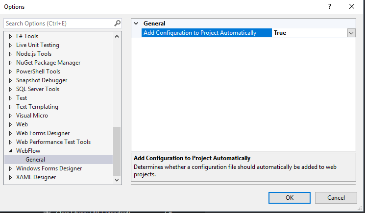
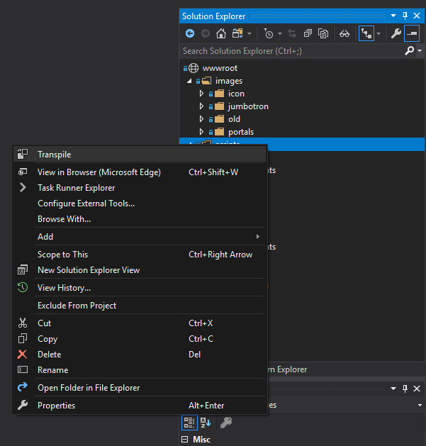



[](https://marketplace.visualstudio.com/items?itemName=ackara.traneleon)
[](https://marketplace.visualstudio.com/items?itemName=acklann.traneleon)
[](https://marketplace.visualstudio.com/items?itemName=acklann.traneleon)
---

## What is Traneleon
Traneleon is a Visual Studio extension that automates the bundling and optimization of your web assets (`.ts`, `.sass` `images`, etc). It is a convenient alternative to task-runner scripts; stop maintaining code that do not provide value to your customer.

## How does it works
Traneleon works by utilizing a configuration file that enables and customize the input-output of it operations.

```xml
<project xmlns="https://raw.githubusercontent.com/ackara/traneleon/master/src/core/intellisense.xsd">
    <images>
        <optimize compression="lossless" progressive="true">
            <pattern>wwwroot/**/*.jpg</pattern>
        </optimize>
    </images>
    
    <!-- Uses Defaults -->
    <sass />
    <typescript />
</project>
```
When opening a web-solution the configuration file will be added automatically if missing. To disable this feature you can visit the options page. `Tools > Traneleon`


As long as a configuration file exist, your files will be processed automatically after being saved. You can disable "transpile files when saved" feature by un-checking the 'watch' icon in the solution-explorer.


To manually transpile your files, you can select then right-click on any file or folder within the solution-explorer and click "Transpile".



## Where can I get it
Traneleon can be install from the [marketplace](https://marketplace.visualstudio.com/items?itemName=acklann.traneleon), [nuget](https://www.nuget.org/packages/acklann.traneleon/) and [powershellgallery](https://www.powershellgallery.com/packages/traneleon/)

`PM> Install-Package Acklann.Traneleon`
